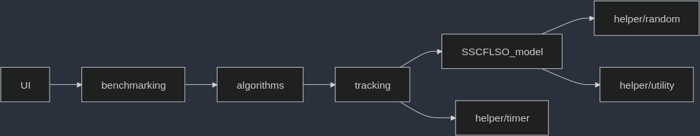

# Solver for Single Source Capacitated Facility Location with Order Problems
## Description
### What does the application do?
This project came to life as part of my research for my master thesis. The application is tailored to load, create, and save models of SSCFLSO instances. It comes with a variety of heuristics as well as analytical tools to measure the performance of those heuristics. 
### What technologies are used and why?
The code is written in C++ because I believe C and C++ being the best suited languages for performance measures. Since some heuristics require a LP solver, we use a state of the art gurobi solver, whose core library is written in C as well. Gurobi's core library being written in C is another reason why I decided to write the application in C++. Using gurobi was a decision by my supervisor.
### Challenges
Getting used to the configuration of Visual Studio was always mystical to me but since the IDE compiled my code and *sometimes* linked successfully everything, I did not think too much about it. When I came to the realization that I need to create an application suitable for linux (I programmed on Windows), I knew that I either had to write a tedious long script to compile and link everything together or finally learn CMake. It was tedious, the documentation, the tutorial, the youtube videos didn't make me smarter. So, I created a tiny project to find the right commands and got CMake to work and then just applied it analogously to this project. A lot of times, [stack overflow](https://stackoverflow.com) helped me out - it was just a question of whether I formulate my issue correctly (and if my issue seemed nowhere to be answered, it was just an 'obvious' mistake, like a typo or not seeing the invisible control characters).
### Outlook 
> 1. 
- Issue: Creating, loading, saving SSCFLSO instances can only be done by altering the main function. 
- Goal: Update CMake to provide executables for these features.
> 2. 
- Issue: Unit testing can only be done by altering the main function. 
- Goal: Update CMake to provide executables for these features.
> 3. Implement an adapter between the application and gurobi, so that other solvers can be used as well.
> 4. Adjust CMake so that if gurobi is not available, only algorithms without the need of a linear program solver are compiled
> 5. Add a python script that adds an algorithm to the project. It should update everything accordingly (UI files, header files, CMake)
## Table of Contents
> 1. Installing the SSCFLSO solver
> 2. Running the SSCFLSO solver
>> 1. Example
> 3. Code logic
>> 1. Format of SSCFLSO instances
>>> 1. Example
>> 2. Code structure
>>> 1. First main component: SSCFLSO_model
>>> 2. Second main component: algorithms
>>> 3. Third main component: UI
>>> 4. Diverse modules: helper
>>> 5. Diverse modules: tracking
>>> 6. Diverse modules: benchmarking
>> 3. Implementing an algorithm
>> 
> 4. License
## Installing the SSCFLSO solver
Download the gurobi optimizer software from the official website:
> <https://www.gurobi.com/downloads/gurobi-software/>

Make sure to aquire a gurobi license since this program cannot (and should not!!) run gurobi without the user having a legally aquired license.

Clone the SSCFLSO repository. You can get it from github [SSCFLSO solver](https://github.com/HatsuneMikuXXX/SSCFLSO) or via the command line:

> Via SSH:
>> ``git clone git@github.com:HatsuneMikuXXX/SSCFLSO.git``

> or via HTTPS
>> ``git clone https://github.com/HatsuneMikuXXX/SSCFLSO.git``

> or via GitHub's CLI:
>> ``gh repo clone HatsuneMikuXXX/SSCFLSO``

If you don't have ``python3`` installed, you can download it from the official website <https://www.python.org/downloads/>. If you are on linux, you can use these commands to install it:
> ``sudo apt-get update``

> ``sudo apt install python3``

If you don't have ``cmake`` installed, you can download it from the official website <https://cmake.org/download/>. Make sure that your CMake version is at least 3.22.1. (Sadly, I don't know the commands for installing the desired version of CMake for linux).

Execute the script ``createTopLevelCMake.py`` (located in the project folder):
> ``python3 createTopLevelCMake.py``

Executing the script will give you two prompts. First, input the path to the include folder provided in the gurobi optimizer software you downloaded in the first step. Then, input the path to the folder containing the libraries (named ``lib``), also contained in the gurobi optimizer software. The script creates a ``CMakeLists.txt`` in the ``src`` folder. Finally, go to the project folder using a terminal and run the following commands:
> ``mkdir build``

> ``cd build``

> ``cmake ../src``

If you are on linux, you should have a ``make`` file, that when executed, will create an executable called ``SSCFLSO``. (TODO: What about Windows?)
## Running the SSCFLSO solver
The basic utility is:
> ``./SSCFLSO --run <path to .plc file | path to dir containing .plc files> <target directory to store results> <timelimit in ms> <algorithm name> [algorithm parameters] [--gurobi]``

Including the flag ``--gurobi`` will cause the application to take the intermediate results of the specified algorithm and use it for the gurobi solver. If the algorithm does not terminate within the given timelimit, gurobi is simply skipped.

A list of algorithm names and their parameters can be displayed by using the command:
> ``./SSCFLSO --showAlgos``

The correct format for ``.plc`` can be found in the section 'Code logic - Format of SSCFLSO instances' or be displayed by using the command:
> ``./SSCFLSO --showFormat``

### Example
Go to the ``build`` folder and run the following commands:
> ``mkdir ../target``
> ``./SSCFLSO --run ../instances/custom/example.plc ../target 10000 localsearch first preprocess --gurobi``
The command will run a local search algorithm and gurobi as postprocessing algorithm. The resulting file is a ``.json`` located in the ``target`` folder. The name of the file contains the name of the instance, the main algorithm, and the date and time. 
## Code logic
This section is intended for developers who want to work on this project. It explains the structure of the code, the model of SSCFLSO instances, and the different modules.
### Format of .plc files
> NOTICE: Data is zero-based: The first client is encoded as 0 and the *n*-th client as *n*-1. Analogous for facilities.

[Number of facilities] TAB [Number of client]

[Demand of client 1] TAB [Demand of client 2] TAB ... TAB [Demand of client n]

[Capacity of facility 1] TAB ... TAB [Capacity of facility m]

[Cost of facility 1] TAB ... TAB [Cost of facility m]

[Supply cost of facility 1 to client 1] TAB ... TAB [Supply cost of facility 1 to client n]  
[Supply cost of facility 2 to client 1] TAB ... TAB [Supply cost of facility 2 to client n]  
...  
[Supply cost of facility m to client 1] TAB ... TAB [Supply cost of facility m to client n]

[Preferences of client 1]  
[Preferences of client 2]  
...  
[Preferences of client n]
#### Example
Consider the file located in ``instances/custom/example.plc``. The format tells us the following:
1. Line 1: We have five facilities and four clients.
2. Line 3: Each client has a unit demand.
3. Line 5: The first two facilities (their id being 0 and 1) can supply two units, facility three and four (their id being 2 and 3) can serve only one unit, and the last facility (id = 4) can supply three units.
4. Line 7: Facility 0 and 1 cost three units each, facility 2 and 3 cost 2 units, and the last facility costs 1 unit.
5. Line 9: The cost for facility 0 to supply each client is one unit (the other lines are read analogously).
6. Line 14: Client 0 prefers facility 4, i.e. the fifth facility, the most and facility 3, i.e. the fourth facility the least (the other lines are read analogously).
### Code structure
All the code responsible for the executable is stored in the ``src`` folder. From there, we have three main components and a variety of modules:
1. Main component 1: SSCFLSO_model
2. Main component 2: algorithms
3. Main component 3: UI
4. Diverse modules: benchmarking, helpers, tracking

The following dependency graph gives a rough overview of the code structure:

#### First main component: SSCFLSO_model
Provides a ``generator`` class and ``validator`` class. 

---
The generator can create SSCFLSO instances from scratch by specifying the number of facilities and clients in the constructor. Other properties such as demand, capacities, and costs can be set through the object's methods which take the id and property value as argument. The preferences can only be set by a criteria, called ``category`` which specifies the preference critera for all clients simultaneously.    
The generator also provides static methods to save the instance that is stored in an object as a ``.plc`` file or create an object by loading a ``.plc`` file.

---
The validator object considers a single SSCFLSO instance at all times. You can provide a solution that specifies only which facilities are open or not and the validator checks if the solution is feasible or not. The solution is encoded as a binary vector where the index of the vector corresponds to the facility id.   
The validator object also computes the objective value. If the solution is infeasible, that objective value is set to -1 to signalize that the solution is infeasible (TODO: Change this to simplify algorithm design). It also provides a proof for infeasibility by returning the id's of those facilities which have their capacity exceeded.   
Lastly, it provides a method to close facilities that do not supply anyone and a heuristic to evaluate an infeasible solution. The heuristic is used by various local search algorithms that attempt to find a (different) feasible solution.
#### Second main component: algorithms
Provides a framework for the individual algorithms. Each implementation of a specific algorithm inherits from the abstract class and has to implement:
1. std::string name() // A way of identifying the algorithm and it's parameters
2. bool post_applyable() // 'true' if the algorithm can make use of an intermediate solution
3. void solve(...) // The implementation of the idea of the algorithm

For experimentation purposes, the ``solve`` method receives, apart from the SSCFLSO instance:
- A struct that holds the solution and value. This is just a container.
- A timer object that can be used to check if the algorithm has still time to do further computation.
- A report object that tracks the progress of the algorithm by storing intermediate solutions, times, and their values.
- A flag to check if the algorithm should run gurobi afterwards.

Additionally, each algorithm has a designated method ``improve_solution`` to report their solution. This solution is only reported to the report object, if the solution is feasible, has a better objective value, and computation is within the given time limit. During reporting, the timer is paused since no parallel programming is in place.
#### Third main component: UI
This is a huge mess of code that is concerned with scanning the user input to run the specified algorithms with the given constraints and options. A lexer generates a token string and checks if the order of arguments is valid. A parser then uses a factory function to retrieve the algorithm objects from the user input. In order to go through the files in a given directory, we use ``std::filesystem`` which requires the C++17 standard. It then uses the ``benchmarking`` module to run the experiments.
#### Diverse modules: helper
The random module provides basic random functions. The seed is set in the main function.   
The utility module provides functions that are often reused and require simple data manipulation or interpretation. Additionally, it contains an API for the standard algorithms that C++ provides. The API always scans the whole container, so specifying the iterators is no longer necessary.   
The timer module provides basic timer functions. You can start and stop the timer and query the remaining time.
#### Diverse modules: tracking
Contains the ``ReportResult`` class and simply stores the intermediate solutions, values, and time stamps. It also writes the results to the specified path it's given.
#### Diverse modules: benchmarking
Provides a sound and fair experiment environment. The benchmark starts the timer and catches any error the algorithm may throw. It also calls the report-object-finish-up method to store the results in their respective ``.json`` file. 
### Implementing an algorithm
The process of implementing a new algorithm is currently very tedious and some parts can and should be automated. Apart from writing the code for the algorithm, one needs to:
1. Add a CMake to the subdirectory and update the CMake in the algorithm folder
2. Update the ``headers.h`` file
3. Update the ``UI`` (the most tedious part)

Point 3. is the biggest problem to writing a script that automates the process. The lexer reads arguments one by one and to check the correct order, it needs a stack that acts as a memory. For example, the local search algorithm has two parameters, so when specifying, as a user, that I want to run local search, I need to specify the two parameters as well. This means, I need to tell the lexer that I now expect two parameters instead of any other type of argument. I am sure, that this process can be automated by a script but it requires a lot of rework.
## License
This software is free of use and most likely not used by others at all. Still, I had a lot of fun writing this README and if by some miraculous coincidence, this project can be useful to anyone, please just give credit to 'Giang Lai' (that is me) as a contributor.